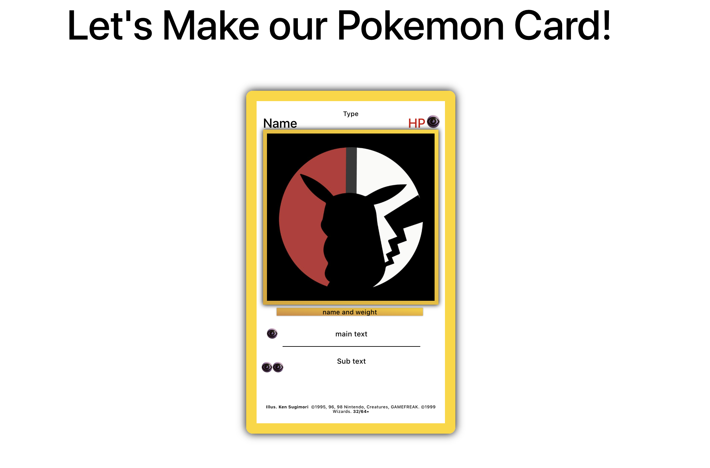

#  **React** Props

### LEARNING OBJECTIVES

_After this lesson, you will be able to:_

- You will understand the basics of React Props.
- Will understand how data flows through-out a React application.
- Have a stronger understanding of the Parent Child relationship.

### STUDENT PRE-WORK

_Before this lesson, you should already be able to:_

- Have a clear understanding of the basics of React and how to start an applicaton.
- Will be able to break a site down into components and understand seperation of concerns via the component methodology.

## What are props?

Up to this point we have made created react application and reformatted HTML into react components. We have also learned that we can dynamically alternate between components with the React Virtual Dom. But, with that seperation comes an issue. How do we share data between these componeents? Props to the rescue!

### Props = Properties

Props is a short hand way of saying properties. By assigning a Property to a compenent we are giving it an attribute with value. Let's look at an HTML element real quick.

```html
<div class="greeting">Hello</div>
```

The `class` part of the html is a property of the html element. We are basically creating a KEY:Value pair for the HTML element. So what would this look like in JS?

```js
let div = {
	type: 'div',
	innerText: 'Hello',
	class: ['greeting']
};
```

Now let's look at a react component.

```js

render() {
  let greeting = 'hello'
	return (
	<Card data={greeting} />
	);
}
```

We have created a Property called `data` and gave it a value of the greeting variable.

So if we break down the component as an object it would like this.

```js
let Card = {
	type: 'react component',
	data: 'hello'
};
```

<details>
  <summary>Your reaction.</summary>
  
</details>

### ACTIVITY 2-min

Now that you can see the elements as an object and the properties as KEY:VALUE pairs. What other type of data can we store in a prop? Think of other examples of data you could assign.

## Who's that Pokemon? (Code Along)



Since we can now assign properties how can we access them?

To practice assigning and using Props we will use an existing application and building out our own pokemon card.

```bash
$ git clone
$ cd React-Props
$ npm i
$ npm start
```

You can see in our file structure two main components. App and Card.

For this code along we will taking the data from App and passing it down to Card and display the info.

in App.js:

```js
class App extends Component {
  render() {
    let cardImg ='http://cdn.shopify.com/s/files/1/1158/9490/products/C000001967-PAR-ZOOM_901de3fa-7c7f-488d-a993-4e17b40d2274_800x.jpg?v=1524058404';
    let name = 'Name';
    return (
      <div className='App'>
	<h1>Let's Make our Pokemon Card!</h1>
	<Card cardImg={cardImg} name={name} />
      </div>
	);
  }
}

export default App;
```

As you can see we are creating variables and assigning their value to the Card to create properties. Let's jump over to Card and see how we use this data.

in Card.js:

```js
class Card extends Component {
  render() {
    const { cardImg, name } = this.props;
      return (
	<p className="alignleft">{name}</p>
	
		)
	}
```

As you can see we access the props in Card and assign them to variables. We can then call those variables where ever we want to replace the info in our card.
